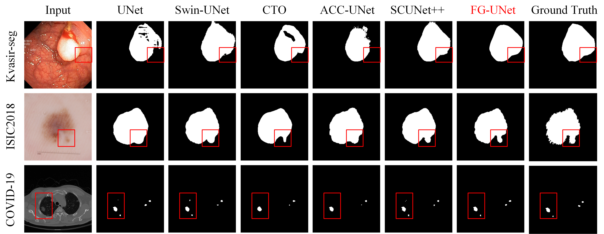
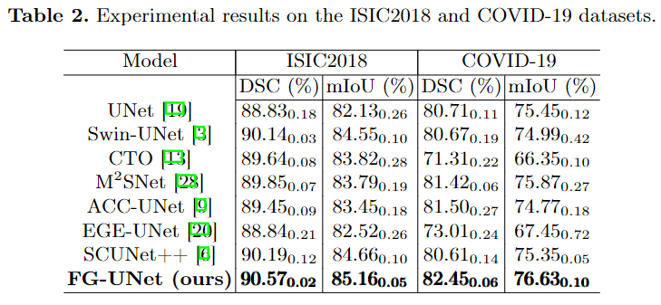
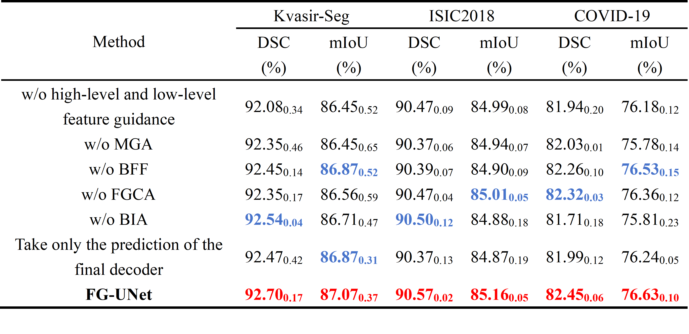

# FG-UNet: Rethinking Feature Guidance of UNet for medical image segmentation
This is an officially public repository of FG-UNet source code. Our repository will continue to be updated based on subsequent research.
# Visualization Results
## Grad-CAM visualization
To validate the effectiveness of the proposed blocks, visualizations using Grad-CAM are presented, 
corresponding to the ablation experiments in Table 3, numbered (a) through (f). The specific details are as follows:
+ (a): w/o high-level and low-level feature guidance;
+ (b): w/o MGA;
+ (c): w/o BFF and object enhancement features;
+ (d): w/o FGCA;
+ (e): w/o BIA;
+ (f): Take only the prediction of the final decoder.

> These visualizations provide compelling evidence for the proposed blocks.
> For example, when the MGA block is removed, the network is slightly challenged in extracting COVID-19 pneumonia of different sizes. 
> Compared to (c), the FG-UNet with the help of the BFF block shows excellent performance in boundary segmentation. 
> Furthermore, the network struggles to capture pneumonia areas when the FGCA block is removed, effectively proving the contextual awareness capability of the FGCA block. 
> Finally, the attention of the network to lesions decreases significantly when the BIA block is removed.
## Qualitative comparison
The qualitative analyses are conducted on three datasets. In the third line, FG-UNet accurately segments COVID-19 pneumonia. Other methods may produce false positives (e.g. UNet, Swin-UNet, SCUNet++) or false negatives (e.g. CTO, ACC-UNet).

# Experiments
## Comparative Experiments

## Ablation Experiments
Due to space constraints, only the experimental results of polyps are presented in the manuscript. The ablation experiments were conducted on three publicly available datasets. Bold red indicates the optimal value, while bold blue indicates the suboptimal value.

# Environment:
`conda create -n FGUNet python=3.10.9`

`conda install pytorch==2.0.1 torchvision==0.15.2 torchaudio==2.0.2 pytorch-cuda=11.8 -c pytorch -c nvidia`
# Datasets
1. Kvasir-Seg [link](https://datasets.simula.no/kvasir-seg/).
2. ISIC2018 [link](https://challenge.isic-archive.com/data/#2018).
3. COVID-19 CT scan lesion segmentation dataset [link](https://www.kaggle.com/datasets/maedemaftouni/covid19-ct-scan-lesion-segmentation-dataset).
# Acknowledgment