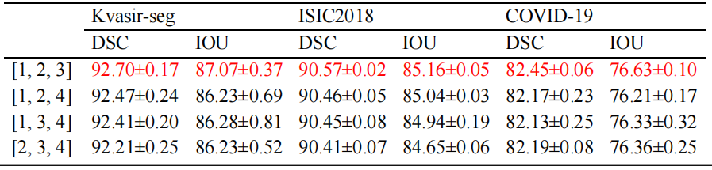
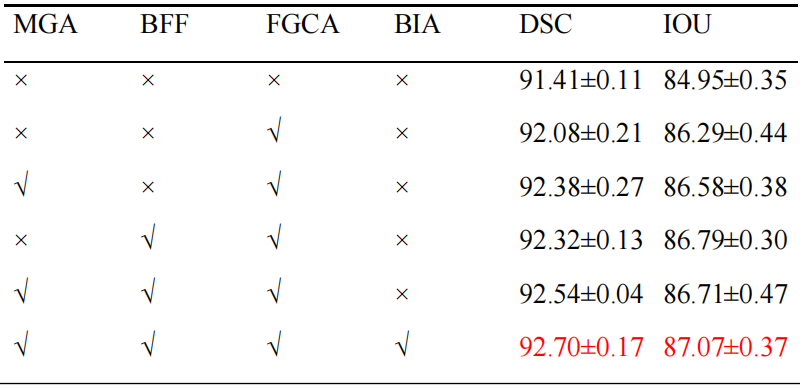

# FG-UNet: Rethinking Feature Guidance for medical image segmentation
This is an officially public repository of FG-UNet source code. Our repository will continue to be updated based on subsequent research.
# Overview
## Overall architecture of FG-UNet

# Experiments
## Comparative Experiments

## Ablation Experiments

## Supplemental Ablation Experiments
The experimental results for the dilation factor d.

The experimental results of different module combinations on the Kvasir-seg dataset

# Visualization Results
## Grad-CAM visualization

## Qualitative comparison

# Environment:
`conda create -n FGUNet python=3.10.9`
`conda install pytorch==2.0.1 torchvision==0.15.2 torchaudio==2.0.2 pytorch-cuda=11.8 -c pytorch -c nvidia`
# Datasets
1. Kvasir-Seg [link](https://datasets.simula.no/kvasir-seg/).
2. ISIC2018 [link](https://challenge.isic-archive.com/data/#2018).
3. COVID-19 CT scan lesion segmentation dataset [link](https://www.kaggle.com/datasets/maedemaftouni/covid19-ct-scan-lesion-segmentation-dataset).
# Acknowledgment