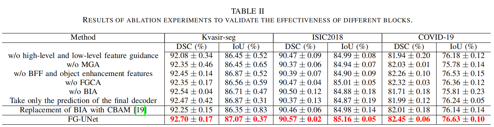

# FG-UNet: Rethinking Feature Guidance of UNet for medical image segmentation
This is an officially public repository of FG-UNet source code. Our repository will continue to be updated based on subsequent research.
# Abstract
Despite the evident advantages of variants of UNet in medical image segmentation, these methods still exhibit limitations in the extraction of foreground, background, and boundary features. This paper introduces an enhanced UNet network, FG-UNet, rooted in feature guidance principles. Specifically, adjacent high-level and low-level features are used to gradually guide the network to perceive organizations and details of lesions, respectively. Subsequently, to accommodate lesion features of different scales, the multi-order gated aggregation (MGA) block is designed based on multi-order feature interactions to extract multi-scale features. Furthermore, a novel feature-guided context-aware (FGCA) block is devised to enhance the capability of FG-UNet to segment lesions by fusing boundary-enhancing features, object-enhancing features, and uncertain areas. Eventually, a bi-dimensional interaction attention (BIA) block is designed to enable the network to highlight crucial features more effectively. To appraise the efficacy of FG-UNet, extensive experiments were conducted on Kvasir-seg, ISIC2018, and COVID-19 datasets. The experimental results illustrate that FG-UNet achieves a DSC score of 92.70% on the Kvasir-seg dataset, which is 1.15% higher than that of the latest SCUNet++, 4.70% higher than that of ACC-UNet, and 5.17% higher than that of UNet. FG-UNet obtains state-of-the-art metrics in different medical image segmentation tasks compared to other networks.
# Overview
## Overall architecture of FG-UNet

# Experiments
## Comparative Experiments

## Ablation Experiments

# Visualization Results
## Grad-CAM visualization
To validate the effectiveness of the proposed blocks, visualizations using Grad-CAM are presented, corresponding to the ablation experiments in Table 2, numbered (a) through (f). The specific details are as follows:
+ (a): w/o high-level and low-level feature guidance;
+ (b): w/o MGA;
+ (c): w/o BFF and object enhancement features;
+ (d): w/o FGCA;
+ (e): w/o BIA;
+ (f): Take only the prediction of the final decoder.

> These visualizations provide compelling evidence for the proposed blocks.
> For example, when the MGA block is removed, the network is slightly challenged in extracting COVID-19 pneumonia of different sizes. 
> Compared to (c), the FG-UNet with the help of the BFF block shows excellent performance in boundary segmentation. 
> Furthermore, the network struggles to capture pneumonia areas when the FGCA block is removed, effectively proving the contextual awareness capability of the FGCA block. 
> Finally, the attention of the network to lesions decreases significantly when the BIA block is removed.
## Qualitative comparison
The qualitative analyses are conducted on three datasets. In the third line, FG-UNet accurately segments COVID-19 pneumonia. Other methods may produce false positives (e.g. UNet, Swin-UNet, SCUNet++) or false negatives (e.g. CTO, ACC-UNet).

# Environment:
`conda create -n FGUNet python=3.10.9`

`conda install pytorch==2.0.1 torchvision==0.15.2 torchaudio==2.0.2 pytorch-cuda=11.8 -c pytorch -c nvidia`
# Datasets
1. Kvasir-Seg [link](https://datasets.simula.no/kvasir-seg/).
2. ISIC2018 [link](https://challenge.isic-archive.com/data/#2018).
3. COVID-19 CT scan lesion segmentation dataset [link](https://www.kaggle.com/datasets/maedemaftouni/covid19-ct-scan-lesion-segmentation-dataset).
# Acknowledgment